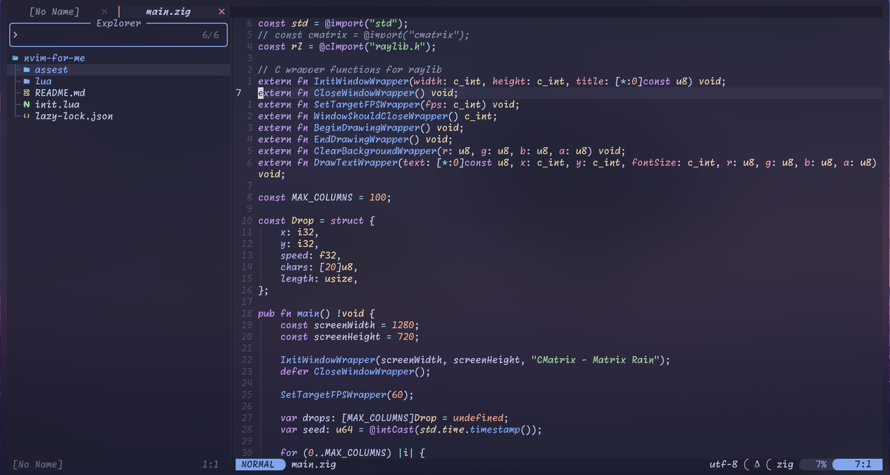
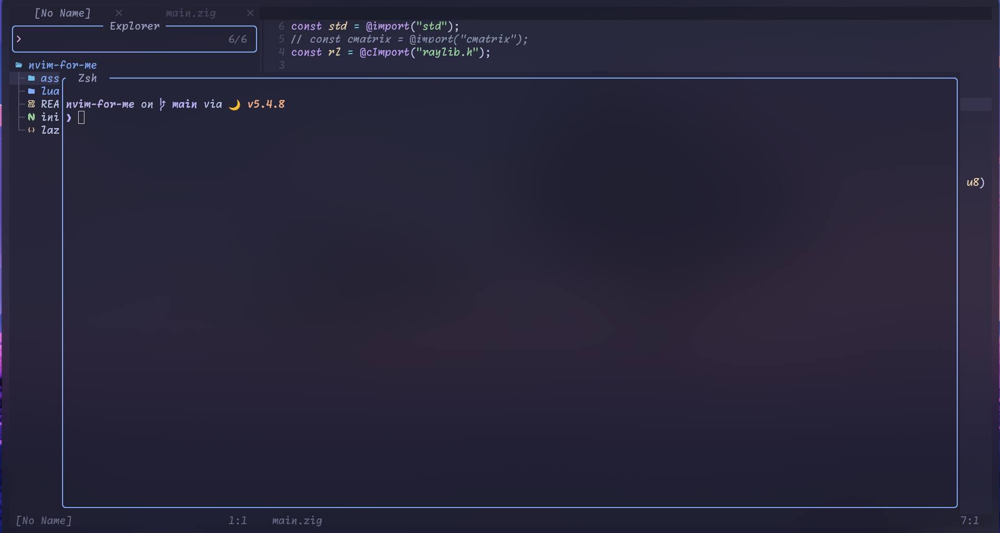

# Neovim Configuration

A modern Neovim configuration using the [lazy.nvim](https://github.com/folke/lazy.nvim) plugin manager with a focus on productivity and aesthetics.

## 🎨 Features

- **Theme**: Multiple beautiful themes (Tokyo Night, Kanagawa, Moonfly, Gruvbox, Rose Pine)
- **Plugin Manager**: lazy.nvim for fast and efficient plugin management
- **LSP**: Full Language Server Protocol support with Mason for easy installation
- **Completion**: nvim-cmp with snippet support via LuaSnip
- **Status Line**: lualine.nvim for a beautiful status bar
- **Git Integration**: gitsigns.nvim for git decorations and operations
- **Dashboard**: Snacks.nvim dashboard with animated startup screen
- **Linting & Formatting**: nvim-lint and conform.nvim for code quality
- **Terminal**: Built-in terminal support with keybindings
- **Markdown**: Preview support with markdown-preview.nvim
- **File Explorer**: Snacks explorer for intuitive file navigation

## 📸 Screenshots

### Dashboard


### Code Editing with LSP



### File Explorer & Terminal



## 📁 Structure

```
.
├── init.lua                    # Entry point - bootstraps lazy.nvim and loads modules
├── lazy-lock.json             # Plugin lock file for reproducible builds
└── lua/
    ├── core/
    │   ├── keymaps.lua        # Global key mappings
    │   └── options.lua        # Neovim options and settings
    └── plugins/
        ├── autopairs.lua      # Auto-close brackets, quotes, etc.
        ├── bufferline.lua     # Buffer tabs
        ├── coloursheme.lua    # Theme configurations
        ├── cmp.lua            # Completion configuration
        ├── comment.lua        # Toggle comments
        ├── conform.lua        # Code formatting
        ├── gitsigns.lua       # Git integration
        ├── indent-blankline.lua # Indentation guides
        ├── lazydev.lua        # Lua development
        ├── lint.lua           # Linting configuration
        ├── love2d.lua         # LÖVE development support
        ├── lspconfig.lua      # LSP configuration
        ├── lualine.lua        # Status line
        ├── luasnip.lua        # Snippet engine
        ├── markdown.lua       # Markdown preview
        ├── mason-lspconfig.lua # LSP server management
        ├── mason.lua          # Package manager for LSP tools
        ├── mini.lua           # Mini.nvim utilities
        ├── noice.lua          # UI improvements
        ├── snacks.lua         # Dashboard and utilities
        ├── snacks-explorer.lua # File explorer
        ├── terminal-commad.lua # Terminal integration
        ├── command.lua        # Command utilities
        ├── trouble.lua        # Diagnostics viewer
        └── treesitter.lua     # Syntax highlighting
```

## 🚀 Quick Start

1. **Install Neovim** (v0.9.0+)
2. **Backup** your existing Neovim configuration:
   ```bash
   mv ~/.config/nvim ~/.config/nvim.backup
   ```
3. **Clone** this repository:
   ```bash
   git clone https://github.com/ijadux2/nvim-for-me.git ~/.config/nvim
   ```
4. **Launch** Neovim - lazy.nvim will automatically install all plugins:
   ```bash
   nvim
   ```

## ⚙️ Requirements

- **Neovim**: v0.9.0 or higher
- **Git**: Required for plugin installation
- **Nerd Font**: JetBrainsMono Nerd Font (configured in options.lua)

## 🔧 Key Bindings

Here are the most important keybindings configured in `lua/core/keymaps.lua`:

### General

- `<leader><leader>` - Open file picker (Snacks)
- `<leader>g` - Live grep (Snacks)
- `<leader>t` - Split terminal (Snacks)
- `<leader>h` - Color scheme picker (Snacks)
- `<leader>d` - Diagnostics picker (Snacks)
- `<C-c>` - Command history (Snacks)
- `<S-r>` - Recent files (Snacks)
- `<S-s>` - Fast navigation up (25 lines)
- `<S-d>` - Fast navigation down (25 lines)

### Buffer Navigation

- `<Tab>` - Next buffer
- `<S-Tab>` - Previous buffer

### Comments

- `<leader>c` - Toggle comment (visual mode)

### LSP

- `gd` - Go to definition
- `gr` - Go to references
- `K` - Show documentation
- `<leader>ca` - Code actions

### Utility

- `<leader>.` - Source current file
- `<C-s>` - Save and quit all windows

## 🎯 Highlights

### Custom Configuration

- **Leader key**: Set to `<Space>` for ergonomic access
- **Line numbers**: Both absolute and relative enabled
- **Clipboard**: System clipboard integration
- **Diagnostics**: Configured to show warnings and errors (no spelling hints)
- **Font**: JetBrainsMono Nerd Font configured
- **Dashboard**: Animated startup screen with custom ASCII art
- **Notification System**: Snacks.nvim notifier with fancy styling

### Language Support

- **Lua Development**: lazydev.nvim for Neovim plugin development
- **LÖVE 2D**: love2d.nvim for game development
- **General**: Treesitter provides syntax highlighting for most languages

### Performance Optimizations

- **Lazy loading**: All plugins load on-demand
- **Lock file**: Ensures reproducible plugin versions
- **Minimal startup**: Only essential configurations loaded initially

## 📚 Documentation

- **Keybinding Reference**: See `lua/core/keymaps.lua` for complete keybinding documentation
- **Plugin Documentation**: Each plugin file contains inline documentation
- **Configuration Details**: Comments in `lua/core/options.lua` explain each setting

## 🛠️ Maintenance

- **Update plugins**: Run `:Lazy` to update all plugins
- **Check health**: Run `:checkhealth` to verify installation
- **Clean lock file**: Remove `lazy-lock.json` to regenerate with latest plugin versions
- **Dashboard**: Access via `<leader>h` or automatically on startup

## 🤝 Contributing

Feel to fork, modify, and adapt this configuration to your needs. This is designed as a solid foundation for a productive Neovim setup.

## 📄 License

This configuration is provided as-is for educational and personal use. Feel free to adapt it for your own workflow.

